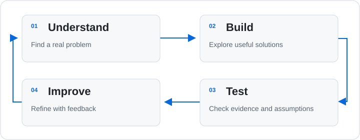

<h1 align="center">Enk</h1>

  <strong>Medical doctor building useful software and exploring new ideas.</strong> 
  Bangkok, Thailand · Software · AI &amp; data · Education · Research · Creative technology

  <a href="#tools--technologies">Tools</a> ·
  <a href="#github-at-a-glance">GitHub activity</a> ·
  <a href="#selected-projects">Projects</a> ·
  <a href="#how-i-think-about-building">Approach</a> ·
  <a href="#questions-and-collaboration">Collaboration</a>

I'm Enk, a medical doctor based in Bangkok, Thailand. I build tools to make complex information easier to understand, reduce repetitive work, and turn ideas into working projects.

Medicine shapes how I think, but not everything I build is medical. My interests span software, AI, data, education, automation, and interactive applications.

<strong>More about me and my interests</strong>

## About me

My background is in clinical medicine and medical education. That perspective makes me interested in how people work with complex information: understanding evidence, learning unfamiliar concepts, and making decisions when time and resources are limited.

I approach software as a way to work on those problems directly. Sometimes that means a tool for teaching or research; sometimes it means automating a repetitive task, organizing scattered information, or building something interactive simply to explore an idea.

I'm continuing to develop my skills in programming, AI, data analysis, and software design through study and hands-on projects. I value clear explanations, thoughtful interfaces, and tools that people can understand—not just operate.

## What I'm interested in

| Area | Questions and ideas I like exploring |
| --- | --- |
| **Software and automation** | How can a small, well-designed application remove repetitive steps, connect fragmented workflows, or make an everyday task easier? |
| **AI and data** | Where can models and data analysis genuinely help? How should their outputs be evaluated, explained, and kept open to human review? |
| **Education and knowledge** | How can visual explanations, interactive exercises, and better-organized information make difficult subjects easier to learn and revisit? |
| **Research and scientific tools** | How can literature discovery, data processing, and reproducible experiments make research easier to inspect, repeat, and build upon? |
| **Interfaces and creative applications** | How can dashboards, visualization, and interactive experiences make software clearer, more engaging, and more enjoyable to use? |

Healthcare is an important application of these interests, not their only destination.

## Tools & technologies

<picture>
  <source media="(prefers-color-scheme: dark)" srcset="https://skillicons.dev/icons?i=python%2Cts%2Cjs%2Creact%2Cfastapi%2Cthreejs%2Cdocker%2Cgithubactions&amp;theme=dark&amp;perline=8">
  <source media="(prefers-color-scheme: light)" srcset="https://skillicons.dev/icons?i=python%2Cts%2Cjs%2Creact%2Cfastapi%2Cthreejs%2Cdocker%2Cgithubactions&amp;theme=light&amp;perline=8">
  
</picture>

Python · TypeScript · JavaScript · React · FastAPI · Three.js · Docker · GitHub Actions

Tools used across my projects—not ratings of expertise. I choose tools to fit the problem and continue learning as the work develops.

<strong>Where these tools fit</strong>

| Area | Examples from my projects |
| --- | --- |
| Languages | Python, TypeScript, JavaScript |
| Web applications and APIs | React, FastAPI |
| Interactive graphics | Three.js, OpenSeadragon |
| Packaging and automation | Docker, GitHub Actions |
| Testing and evaluation | Automated tests, reproducible experiments, documented acceptance criteria |

This is a view of the tools used in these repositories, not an exhaustive skills list or a claim of equal expertise in every technology.

## GitHub at a glance

<picture>
  <source media="(prefers-color-scheme: dark)" srcset="https://github-stats-extended.vercel.app/api?username=Enksodsoon&amp;show_icons=true&amp;hide_rank=true&amp;disable_animations=true&amp;card_width=420&amp;custom_title=Public%20GitHub%20activity&amp;bg_color=0d1117&amp;title_color=58a6ff&amp;text_color=c9d1d9&amp;icon_color=58a6ff&amp;border_color=30363d">
  <source media="(prefers-color-scheme: light)" srcset="https://github-stats-extended.vercel.app/api?username=Enksodsoon&amp;show_icons=true&amp;hide_rank=true&amp;disable_animations=true&amp;card_width=420&amp;custom_title=Public%20GitHub%20activity&amp;bg_color=ffffff&amp;title_color=0969da&amp;text_color=1f2328&amp;icon_color=0969da&amp;border_color=d1d9e0">
  
</picture>
<picture>
  <source media="(prefers-color-scheme: dark)" srcset="https://github-stats-extended.vercel.app/api/top-langs/?username=Enksodsoon&amp;layout=donut&amp;langs_count=5&amp;card_width=420&amp;disable_animations=true&amp;custom_title=Languages%20in%20public%20repos&amp;bg_color=0d1117&amp;title_color=58a6ff&amp;text_color=c9d1d9&amp;icon_color=58a6ff&amp;border_color=30363d">
  <source media="(prefers-color-scheme: light)" srcset="https://github-stats-extended.vercel.app/api/top-langs/?username=Enksodsoon&amp;layout=donut&amp;langs_count=5&amp;card_width=420&amp;disable_animations=true&amp;custom_title=Languages%20in%20public%20repos&amp;bg_color=ffffff&amp;title_color=0969da&amp;text_color=1f2328&amp;icon_color=0969da&amp;border_color=d1d9e0">
  
</picture>

<picture>
  <source media="(prefers-color-scheme: dark)" srcset="https://github-profile-summary-cards.vercel.app/api/cards/profile-details?username=Enksodsoon&amp;theme=github_dark">
  <source media="(prefers-color-scheme: light)" srcset="https://github-profile-summary-cards.vercel.app/api/cards/profile-details?username=Enksodsoon&amp;theme=github">
  
</picture>

Provider-reported activity and public-repository summaries. Language proportions describe repository code, not proficiency. These widgets are cached and may differ from GitHub's own totals.

## Selected projects

Practical applications, information workflows, creative experiments, and research.

<a href="https://github.com/Enksodsoon/PathLab-Viewer">
<picture>
  <source media="(prefers-color-scheme: dark)" srcset="https://github-stats-extended.vercel.app/api/pin/?username=Enksodsoon&amp;repo=PathLab-Viewer&amp;description_lines_count=2&amp;bg_color=0d1117&amp;title_color=58a6ff&amp;text_color=c9d1d9&amp;icon_color=58a6ff&amp;border_color=30363d">
  <source media="(prefers-color-scheme: light)" srcset="https://github-stats-extended.vercel.app/api/pin/?username=Enksodsoon&amp;repo=PathLab-Viewer&amp;description_lines_count=2&amp;bg_color=ffffff&amp;title_color=0969da&amp;text_color=1f2328&amp;icon_color=0969da&amp;border_color=d1d9e0">
  
</picture>
</a>
<a href="https://github.com/Enksodsoon/general-pathology-research-digest">
<picture>
  <source media="(prefers-color-scheme: dark)" srcset="https://github-stats-extended.vercel.app/api/pin/?username=Enksodsoon&amp;repo=general-pathology-research-digest&amp;description_lines_count=2&amp;bg_color=0d1117&amp;title_color=58a6ff&amp;text_color=c9d1d9&amp;icon_color=58a6ff&amp;border_color=30363d">
  <source media="(prefers-color-scheme: light)" srcset="https://github-stats-extended.vercel.app/api/pin/?username=Enksodsoon&amp;repo=general-pathology-research-digest&amp;description_lines_count=2&amp;bg_color=ffffff&amp;title_color=0969da&amp;text_color=1f2328&amp;icon_color=0969da&amp;border_color=d1d9e0">
  
</picture>
</a>

<a href="https://github.com/Enksodsoon/Duckrace">
<picture>
  <source media="(prefers-color-scheme: dark)" srcset="https://github-stats-extended.vercel.app/api/pin/?username=Enksodsoon&amp;repo=Duckrace&amp;description_lines_count=2&amp;bg_color=0d1117&amp;title_color=58a6ff&amp;text_color=c9d1d9&amp;icon_color=58a6ff&amp;border_color=30363d">
  <source media="(prefers-color-scheme: light)" srcset="https://github-stats-extended.vercel.app/api/pin/?username=Enksodsoon&amp;repo=Duckrace&amp;description_lines_count=2&amp;bg_color=ffffff&amp;title_color=0969da&amp;text_color=1f2328&amp;icon_color=0969da&amp;border_color=d1d9e0">
  
</picture>
</a>
<a href="https://github.com/Enksodsoon/DENSER-WSI">
<picture>
  <source media="(prefers-color-scheme: dark)" srcset="https://github-stats-extended.vercel.app/api/pin/?username=Enksodsoon&amp;repo=DENSER-WSI&amp;description_lines_count=2&amp;bg_color=0d1117&amp;title_color=58a6ff&amp;text_color=c9d1d9&amp;icon_color=58a6ff&amp;border_color=30363d">
  <source media="(prefers-color-scheme: light)" srcset="https://github-stats-extended.vercel.app/api/pin/?username=Enksodsoon&amp;repo=DENSER-WSI&amp;description_lines_count=2&amp;bg_color=ffffff&amp;title_color=0969da&amp;text_color=1f2328&amp;icon_color=0969da&amp;border_color=d1d9e0">
  
</picture>
</a>

**PathLab's desktop companion:** [Forge](https://github.com/Enksodsoon/PathLab-Forge) prepares supported slide datasets locally.

<strong>Project overviews, useful starting points, and limitations</strong>

These projects show different sides of my work: practical applications, information workflows, creative experiments, and research.

### PathLab · Healthcare and education

[**Viewer**](https://github.com/Enksodsoon/PathLab-Viewer) · [**Forge**](https://github.com/Enksodsoon/PathLab-Forge)

Tools for working with high-resolution digital microscope slides. Viewer provides private review and browser-based sharing of published slide views. Forge is its local desktop companion for inspecting supported slide datasets, preparing them for viewing, and uploading prepared packages.

**Explore this for:** image-heavy applications, local-to-web workflows, and privacy-conscious sharing. The projects are in development; their documentation defines supported features and readiness.

### Research Digest · Information and automation

[**Explore the repository**](https://github.com/Enksodsoon/general-pathology-research-digest)

A prototype for finding and organizing pathology research literature. It gathers paper records, removes duplicates, distinguishes preprints from peer-reviewed publications, and produces structured digests. A separate workflow scouts free medical learning events.

**Explore this for:** information retrieval, source checking, deduplication, and scheduled workflows. Discovery and summarization are starting points for review—not substitutes for evaluating the underlying evidence.

### Duck Race Randomizer · Creative software

[**Explore the repository**](https://github.com/Enksodsoon/Duckrace)

An interactive 3D duck-race randomizer built with React and Three.js. It brings together a browser-based application, a rendered race track, and visual details such as duck models, labels, and finish effects.

**Explore this for:** browser graphics and playful interaction design. It represents the more experimental side of my work, outside healthcare and research.

### DENSER-WSI · Research and evaluation

[**Explore the repository**](https://github.com/Enksodsoon/DENSER-WSI)

A research framework for investigating whole-slide image compression. It uses matched comparisons, explicit acceptance criteria, and complete storage accounting to test ideas rather than assume that a smaller file is automatically a better result.

**Explore this for:** experimental design, image-processing evaluation, and reproducibility. The public repository contains code, synthetic fixtures, specifications, tests, and aggregate reports; it makes no clinical validation claim.

[**Explore all public repositories →**](https://github.com/Enksodsoon?tab=repositories)

Each repository is the source of truth for setup, intended use, licensing, and limitations. A public repository or passing automated test does not, by itself, establish production or clinical readiness.

[**Explore all public repositories →**](https://github.com/Enksodsoon?tab=repositories)

## How I think about building

<picture>
  <source media="(prefers-color-scheme: dark)" srcset="./assets/workflow-dark.svg">
  <source media="(prefers-color-scheme: light)" srcset="./assets/workflow-light.svg">
  
</picture>

**Problem first. Clear interfaces. Practical resource use. Evidence and limitations visible.**

<strong>My approach and what I'm learning</strong>

## How I approach projects

**Start with the problem, not the technology.** I want to understand who will use a tool, what is difficult today, and what an improvement would look like. A simpler workflow can be more valuable than a longer feature list.

**Make the useful parts approachable.** I care about readable interfaces, clear documentation, and sensible setup requirements. Storage, bandwidth, compute, and maintenance effort are part of the design—not problems to leave until the end.

**Keep evidence and limitations visible.** I aim to make assumptions explicit, test important behavior, respect privacy, and distinguish working features from plans. For research and AI, I care about fair comparisons, reproducibility, and knowing when human review is still needed.

## What I'm learning and exploring

I'm interested in making the whole path from idea to useful application more understandable: organizing data, designing software, evaluating models, and maintaining a system after the first prototype works.

Questions I keep coming back to include how to make AI useful without obscuring its limitations, how to design interactive learning experiences, and how to build capable tools with modest infrastructure. These are directions for learning and future work, not promises about features already available.

## Questions and collaboration

I welcome practical ideas, thoughtful feedback, and perspectives from different disciplines. For project-specific questions, start with the relevant repository's README and issue tracker.

<strong>Using a project, contributing, or exploring a research idea</strong>

I welcome thoughtful feedback, practical problems, and perspectives from people with different backgrounds. Useful contributions can include a clearer explanation, a reproducible bug report, a usability observation, or a better way to test an idea—not only code.

**Using a project?** Start with its README for setup and supported workflows. For a non-sensitive question or bug report, use its issue tracker when available and describe what you expected, what happened, and the relevant environment.

**Building on a project?** Check its license, existing issues, and contribution guidance. Focused changes, documentation improvements, and tests are useful ways to participate.

**Exploring a research idea?** Make the question, assumptions, comparison, and evaluation method clear. I'm interested in ideas that connect disciplines and produce something others can understand, evaluate, or use.

Please keep personal data, patient information, credentials, and sensitive security details out of public issues. Use synthetic examples where possible and follow the repository's private reporting guidance for security concerns.

Please keep patient information, personal data, credentials, and sensitive security details out of public issues.

---

<strong>About the visual widgets</strong>

Icons: [Skill Icons](https://github.com/tandpfun/skill-icons). Stats, language charts, and repository cards: [GitHub Stats Extended](https://github.com/stats-organization/github-stats-extended). Contribution history: [GitHub Profile Summary Cards](https://github.com/vn7n24fzkq/github-profile-summary-cards). The workflow diagram is an original, static SVG stored in this repository; it makes no network requests of its own.

Light and dark image variants are provided. These external services receive the public username or public repository names in the image URLs; no personal access token is embedded or required by this README.

Widgets can be cached, delayed, rate-limited, or temporarily unavailable. Repository links and expandable descriptions remain available independently. Activity counts are not a measure of software quality, and language proportions are not skill scores. Repository documentation defines current scope, readiness, licensing, and limitations.

